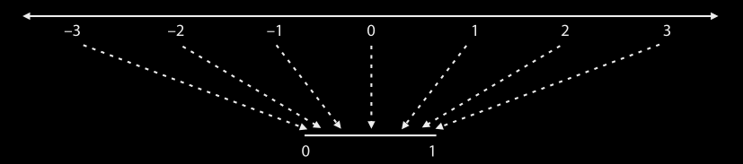

# Machine Learning: Zero to Hero

This repository contains a collection of machine learning implementations and experiments. The Jupyter notebooks are located in the [src](src/) directory, and relevant datasets are in the [datasets](datasets/) directory.

## Regression

### Linear Regression

**Predicting Exam Scores (Simple Linear Regression)**

We start with the "Hello World" of machine learning. In this project, we analyze the relationship between study hours and exam scores. We implement a model to fit a line through the data, observing a strong positive correlation where every additional hour of study adds approximately 11.29 points to the score. We also explore error metrics like MSE and RMSE to evaluate our model's performance.

- [See code](src/regression/linear_regression.ipynb)

---

**Housing Price Prediction (Linear Regression from Scratch)**

In this deep-dive notebook, we build Linear Regression from the ground up to understand the math behind the "magic." Instead of jumping straight to libraries, we implement the core logic manually using "learning tricks" (like the Square Trick) and a custom training loop to iteratively minimize error. We visualize how the line adjusts over time before finally comparing our manual results with the industry-standard `scikit-learn` implementation.

- [See code](src/regression/linear_regression_from_scratch.ipynb)

---

**Real Estate Price Prediction (Multivariate Regression)**

We expand our Linear Regression model to handle multiple features. Instead of a simple line, we fit a plane in 3D space to predict house prices based on size (sq ft) and the number of bedrooms. This introduces the concept of weights for different features and how they combine to form a prediction.

- [See code](src/regression/linear_regression.ipynb)

---

**Marketing ROI Estimation (Multivariate Regression)**

In this business-centric example, we apply Multivariate Regression to optimize marketing strategies. By analyzing historical data on TV and Radio advertising budgets, we build a model to predict future Sales figures. We interpret the model coefficients to understand the return on investment for specific advertising channels and use the R-squared ($R^2$) score to determine how well our model explains the variance in sales.

- [See code](src/regression/linear_regression.ipynb)

---

## Classification

**Implementing the Perceptron Algorithm (Binary Classification)**

A Perceptron is the foundational component of neural networks and performs binary classification by separating data points with a linear boundary. This project focuses on implementing the core logic of this model, which uses a linear combination of features to make a decision (e.g., Happy/Sad). We explore the Perceptron Trick, the training loop, and the final decision boundary.

- [See manual code](src/classification/perceptron_manual.ipynb)
- [See main code](src/classification/alien_perceptron.ipynb)

---

**Sentiment Analysis with Logistic Regression (Probabilistic Classification)**

Logistic Regression moves beyond the "hard" decisions of the Perceptron by introducing probabilities. By applying the Sigmoid function to a linear combination of features, the model predicts the likelihood of an input belonging to a specific class (0 to 1). This project covers the manual implementation of the Logistic Trick, Log Loss (Cross-Entropy), and a comparison with `scikit-learn`'s optimized implementation.

- [See code](src/classification/logistic_regression_manual.ipynb)

---

**Sentiment Analysis: Classifying IMDB Movie Reviews**

Applying Logistic Regression to a real-world dataset of 50,000 IMDB movie reviews. We use `CountVectorizer` to transform text into numerical features and identify the most influential words for positive and negative sentiment. The model allows us to predict the probability of a review being positive and identifies the "most extreme" reviews in the dataset.

- [See code](src/classification/sentiment_analysis.ipynb)

---

**Logistic Regression with Scikit-Learn**

This project demonstrates the use of the industry-standard `scikit-learn` library to build a classification model. We focus on training the model on a binary dataset, extracting coefficients and intercepts, and visualizing the decision boundary that separates the classes.

- [See code](src/classification/logistic_regression_scikit.ipynb)

---

Ongoing...

**License**

MIT